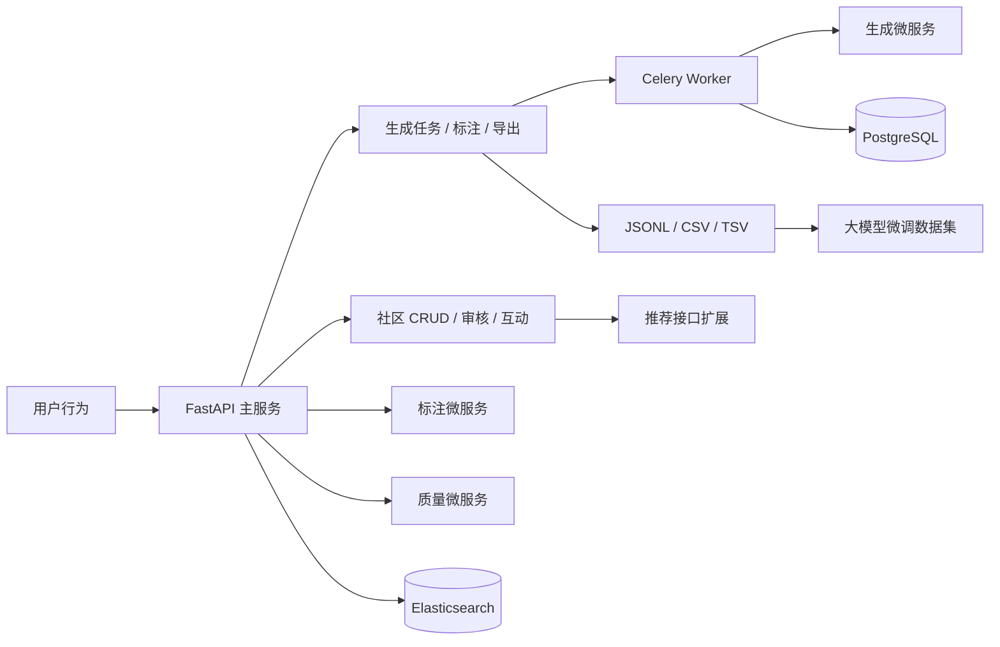

# WANDERCHINA 社区与数据管道模块

WANDERCHINA 外国人在华旅行智能伴侣平台 — **社区互动** + **多智能体数据生成/标注/质量评估** 后端骨架。

## 架构概览



| 层级 | 技术选型 |
|------|----------|
| API | FastAPI + JWT/OAuth2 |
| 数据库 | PostgreSQL + SQLAlchemy 2.0 |
| 缓存/队列 | Redis + Celery |
| 搜索/推荐 | Elasticsearch（接口预留） |
| 模型 | 独立微服务 REST（生成 / 标注 / 质量） |

## 进入社区流程（登录 + 资料完善）

1. `POST /api/v1/auth/token` 登录，响应含 `profile_completed`、`missing_fields`
2. 若资料未完善，调用：
   - `PUT /api/v1/profile/me` 填写姓名（`display_name`）、简介等
   - `POST /api/v1/profile/avatar` 上传头像（multipart）
3. `GET /api/v1/community/access` 检查是否可进入社区
4. 资料完善后，方可访问帖子列表、发帖、评论等接口

未登录访问社区接口返回 `401`；已登录但资料未完善返回 `403`（`PROFILE_INCOMPLETE`）。

## 角色与权限

| 角色 | 能力 |
|------|------|
| `tourist` | 发帖、评论、互动、获取推荐 |
| `student` | 攻略、翻译互助、参与数据生成 |
| `local` | 地道推荐、向导相关内容、数据生成 |
| `admin` | 审核、质量评估、数据集导出 |

## 快速开始

```bash
cp .env.example .env
docker compose up -d postgres redis elasticsearch

pip install -r requirements.txt
alembic revision --autogenerate -m "init"
alembic upgrade head

# 模型微服务（三个终端）
uvicorn model_services.generation.main:app --port 8001
uvicorn model_services.annotation.main:app --port 8002
uvicorn model_services.quality.main:app --port 8003

# 主 API + Worker
uvicorn app.main:app --reload --port 8000
celery -A app.tasks.celery_app worker --loglevel=info
```

- Swagger: http://localhost:8000/docs  
- 健康检查: `GET /api/v1/health`

## 核心 API

| 模块 | 路径 | 说明 |
|------|------|------|
| 认证 | `POST /api/v1/auth/register`, `POST /api/v1/auth/token` | 注册与 JWT |
| 资料 | `GET/PUT /api/v1/profile/me`, `POST /api/v1/profile/avatar` | 姓名、头像、简介 |
| 社区准入 | `GET /api/v1/community/access` | 登录且资料完善检查 |
| 社区 | `POST/GET /api/v1/community/posts` | 帖文（须登录+资料完善） |
| 互动 | `POST .../comments`, `.../interactions` | 评论、点赞、分享 |
| 翻译 | `POST /api/v1/community/translate` | 多语种（对接模型服务） |
| 生成 | `POST /api/v1/dataset/generate` | 异步 Celery 任务 |
| 标注 | `POST /api/v1/dataset/annotate` | 自动 + 多轮交互扩展 |
| 质量 | `POST /api/v1/dataset/quality` | BLEU/ROUGE/多样性等 |
| 导出 | `POST /api/v1/dataset/export` | JSONL / CSV / TSV |

## 数据流

用户行为 → 后端 → 生成/标注模型 → PostgreSQL → 质量评估 → 微调数据集 → 社区推荐（Elasticsearch 扩展）

## 待扩展（按需求文档）

- [ ] Elasticsearch 推荐与地理检索
- [ ] 付费向导 / 翻译接单与积分
- [ ] BERTScore / Dynabench 外部评测接入
- [ ] GDPR 脱敏中间件与审计日志
- [ ] K8s Helm Chart 与 GPU 模型部署

## 测试

```bash
pytest tests/ -q
```
